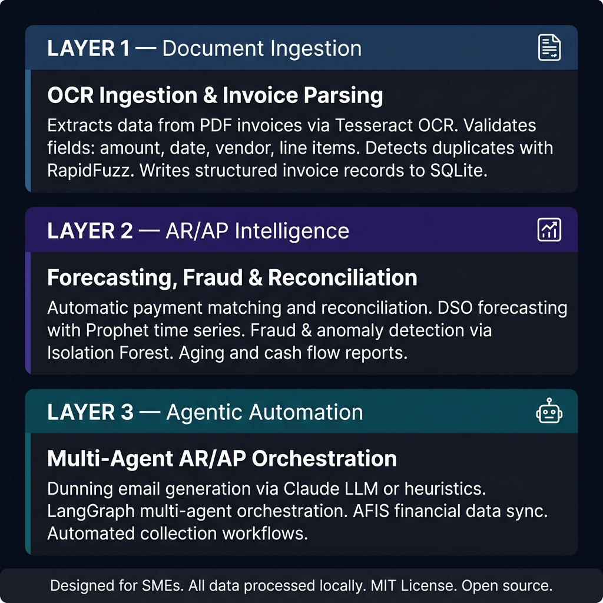
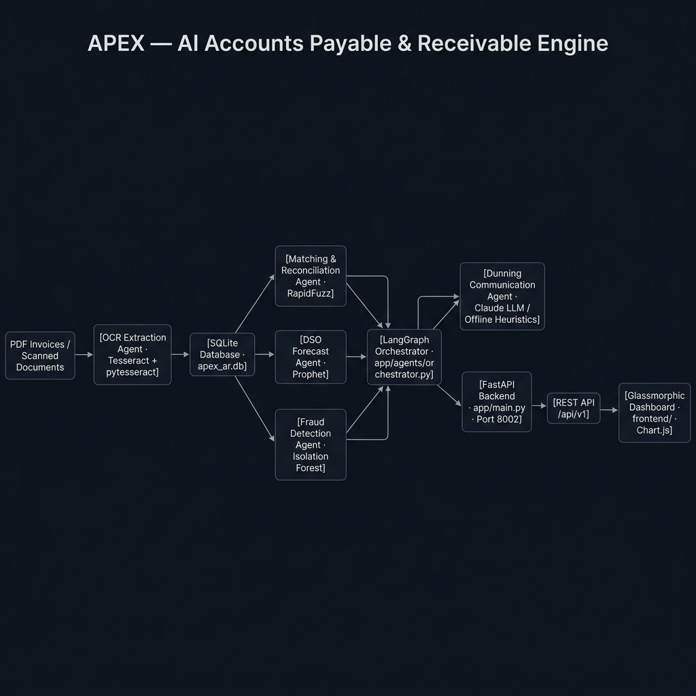
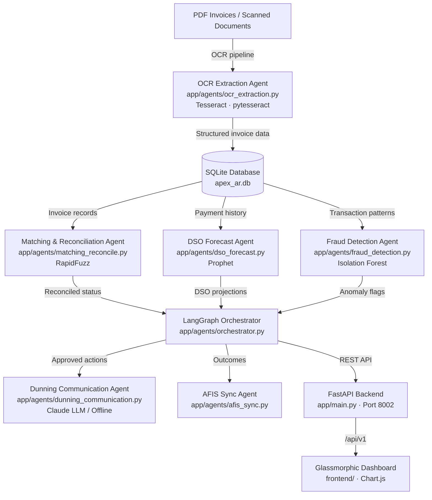

# APEX — AI Accounts Payable & Receivable Engine

[](https://opensource.org/licenses/MIT)
[](https://www.python.org/)
[](https://fastapi.tiangolo.com/)
[](https://github.com/langchain-ai/langgraph)
[](https://facebook.github.io/prophet/)
[](https://airc.nist.gov/RMF)

> **An open-source AR/AP automation engine that ingests invoices via OCR, reconciles payments, forecasts DSO, detects fraud, and automates dunning — designed for Small and Medium Enterprises.**

APEX is an open-source accounts payable and receivable automation engine. It processes PDF invoices through an OCR pipeline, reconciles them against payment records, projects Days Sales Outstanding (DSO) with time-series forecasting, detects financial anomalies using Isolation Forest, and orchestrates dunning communications — all running locally with no cloud subscription required.

---

## How It Works — Three Integrated Layers



### Layer 1 — Document Ingestion (OCR Pipeline)

Extracts structured data from PDF invoices and scanned documents using Tesseract OCR. Validates fields (amount, date, vendor, line items), detects near-duplicate invoices using RapidFuzz fuzzy matching, and writes validated records to a local SQLite database.

```
Input:  PDF invoices / scanned AR-AP documents
Output: Structured invoice records — validated, deduplicated, persisted to SQLite
```

### Layer 2 — AR/AP Intelligence

Runs automatic payment matching against invoice records using configurable tolerance logic. Projects DSO (Days Sales Outstanding) with Facebook Prophet time-series models. Detects financial fraud and anomalous payment patterns via Isolation Forest. Generates aging reports and cash collection analytics.

```
Input:  Invoice database + payment records
Output: DSO forecast · fraud flags · reconciled AR/AP status · aging report
```

### Layer 3 — Agentic Automation

LangGraph orchestrates six specialist agents across the AR/AP lifecycle. Generates dunning email drafts via Anthropic Claude (or offline heuristics). Syncs processed financial outcomes back to the AFIS financial intelligence layer. Supports automated collection workflow scheduling.

```
Input:  Reconciled records + DSO + fraud signals
Output: Dunning emails · collection status · AFIS sync · audit trail
```

---

## Technical Architecture





### REST API Surface

| Endpoint | Method | Description |
|---|---|---|
| `/api/v1/invoices` | `GET / POST` | List invoices or upload new invoice for OCR processing |
| `/api/v1/reconciliation` | `GET / POST` | Trigger payment matching and view reconciliation status |
| `/api/v1/dunning` | `GET / POST` | List pending dunning actions or trigger communication |
| `/api/v1/fraud` | `GET` | Fraud alerts and anomaly detection results |
| `/api/v1/forecast` | `GET` | DSO projections with time-series confidence bands |
| `/api/v1/reports` | `GET` | Aging reports and AR/AP cash flow summaries |
| `/api/v1/system` | `GET` | System status, AI mode (`llm` or `offline`), version |

### Stack

| Component | Technology |
|---|---|
| Backend | FastAPI 0.115 (Python 3.11+) |
| Agent Orchestration | LangGraph 0.2.39 · LangChain 0.3.7 |
| OCR | Tesseract · pytesseract · pdf2image · Pillow |
| DSO Forecasting | Prophet 1.1.5 |
| Fraud Detection | scikit-learn · Isolation Forest |
| Fuzzy Matching | RapidFuzz |
| AI Narrative | Anthropic Claude (optional) · offline heuristics fallback |
| Database | SQLite (zero-server, local-first) · SQLAlchemy |
| Dashboard | HTML + CSS + JavaScript · Chart.js |
| Email | aiosmtplib (async dunning dispatch) |
| Testing | pytest · pytest-asyncio · httpx |

---

## Key Design Decisions

**Local-first, privacy by design.** All invoice documents and payment records stay on the SME's machine. The optional LLM integration sends only structured dunning context to the API — never raw invoice images or financial records.

**Zero-server dependency.** SQLite requires no database server. The entire engine starts with `python run.py`.

**Works without an API key.** OCR ingestion, reconciliation, DSO forecasting, fraud detection, and all dashboards operate in full offline mode. The AI dunning agent degrades gracefully to deterministic email templates.

**Offline-first dunning.** Even without Claude, APEX generates structured dunning communications using rule-based templates calibrated by overdue days, invoice amount, and payment history.

**NIST AI RMF 1.0 alignment.** Every agent action, fraud flag, and AI-generated dunning draft is logged to a persistent audit trail following NIST governance principles: validity, reliability, explainability, and human oversight.

---

## Who Is This For?

APEX is built for SME finance teams, accountants, and AR/AP managers who need automation without enterprise-grade ERP costs.

**You do not need a data science background.** Upload your invoices, connect to your payment records, and run `python run.py`. APEX handles OCR, matching, forecasting, and dunning automatically.

---

## Quickstart

```bash
git clone https://github.com/Albertsfc/APEX.git
cd APEX
pip install -r requirements.txt
python run.py
```

Open `http://localhost:8002` in your browser.

---

## AI Modes

**LLM Mode** — set environment variable and restart:

```bash
# Linux/macOS
export ANTHROPIC_API_KEY=your_key_here

# Windows
set ANTHROPIC_API_KEY=your_key_here

python run.py
```

**Offline Mode** (default): rule-based dunning templates and deterministic reconciliation logic. Full OCR, forecasting, and fraud detection operate identically in both modes.

---

## Getting Started

### Prerequisites
- Python 3.11 or higher
- Git
- Tesseract OCR binary ([install guide](https://github.com/tesseract-ocr/tesseract))

### Installation

```bash
# 1. Clone and navigate
git clone https://github.com/Albertsfc/APEX.git
cd APEX

# 2. Create virtual environment
python -m venv venv
source venv/bin/activate   # Windows: venv\Scripts\activate

# 3. Install dependencies
pip install -r requirements.txt

# 4. Configure environment
cp .env.example .env
# Set TESSERACT_CMD path and optionally ANTHROPIC_API_KEY in .env

# 5. Launch
python run.py
```

### Running Tests

```bash
pytest tests/ -v
```

---

## NIST AI RMF 1.0 Alignment

| NIST Function | APEX Implementation |
|---|---|
| **GOVERN** | MIT License · open audit trail · traceable agent decision logic |
| **MAP** | AR/AP domain scoped to SME invoice processing · documented assumptions |
| **MEASURE** | Automated pytest suite · DSO residuals computed per run · fraud scoring per transaction |
| **MANAGE** | Offline fallback · duplicate flagging · human-review step before dunning dispatch · explainable Isolation Forest |

The AI dunning agent sends only structured invoice context (amount, days overdue, vendor name) to the LLM API — never raw invoice images or scanned documents.

---

## Repository Structure

```
APEX/
├── app/
│   ├── main.py                      ← FastAPI app · route registration · static serving
│   ├── config.py                    ← Pydantic settings · environment variables
│   ├── llm_client.py                ← Provider-agnostic LLM client (Claude + offline)
│   ├── agents/
│   │   ├── orchestrator.py          ← LangGraph state machine · agent coordination
│   │   ├── ocr_extraction.py        ← Tesseract OCR · field parsing · validation
│   │   ├── matching_reconcile.py    ← RapidFuzz payment matching · reconciliation logic
│   │   ├── dso_forecast.py          ← Prophet time-series DSO forecasting
│   │   ├── fraud_detection.py       ← Isolation Forest anomaly scoring
│   │   ├── dunning_communication.py ← Dunning email generation (LLM + offline)
│   │   └── afis_sync.py             ← Financial outcome sync to AFIS layer
│   ├── api/
│   │   ├── router.py                ← API router aggregation (prefix /api/v1)
│   │   ├── invoices.py              ← Invoice CRUD and OCR trigger
│   │   ├── reconciliation.py        ← Payment matching endpoints
│   │   ├── dunning.py               ← Dunning action endpoints
│   │   ├── fraud.py                 ← Fraud alert endpoints
│   │   ├── forecast.py              ← DSO forecast endpoints
│   │   ├── reports.py               ← Aging report and summary endpoints
│   │   └── system.py                ← Health check and system status
│   ├── database/
│   │   ├── db_manager.py            ← SQLite init · schema creation
│   │   ├── models.py                ← SQLAlchemy ORM models
│   │   └── schema.sql               ← Tables: invoices · payments · audit_log
│   ├── ml/
│   │   ├── dso_prophet.py           ← Prophet model training and forecasting
│   │   └── isolation_forest.py      ← Isolation Forest fraud model
│   ├── plugins/
│   │   ├── afis_reader.py           ← Read-only AFIS database connector
│   │   ├── axis_reader.py           ← External data integration
│   │   ├── email_connector.py       ← aiosmtplib async email dispatch
│   │   └── pdf_storage.py           ← Local PDF storage management
│   └── skills/
│       ├── extract_invoice_fields.py
│       ├── detect_duplicate_invoice.py
│       ├── match_invoice_payment.py
│       └── generate_dunning_email.py
├── data/                            ← Sample invoice datasets
├── docs/
│   └── images/                      ← Architecture diagrams
├── frontend/
│   ├── index.html                   ← Glassmorphic dark-mode dashboard
│   ├── styles.css
│   └── app.js                       ← Chart.js · API integration · dunning UI
├── tests/
│   └── test_api.py                  ← API endpoint tests
├── .env.example                     ← Environment variable template
├── CHANGELOG.md
├── requirements.txt
└── run.py                           ← Single-command launcher
```

---

## Contributing

Areas where contributions are most needed:
- Additional OCR backends (AWS Textract, Azure Form Recognizer)
- Support for DOCX and CSV invoice formats
- Multi-currency reconciliation support
- Docker Compose setup for zero-dependency deployment

---

## Changelog

### Latest: v1.0.0
- Full AR/AP automation pipeline with OCR, reconciliation, DSO forecast, and dunning

---

## License

MIT License — free to use, adapt, and redistribute.
